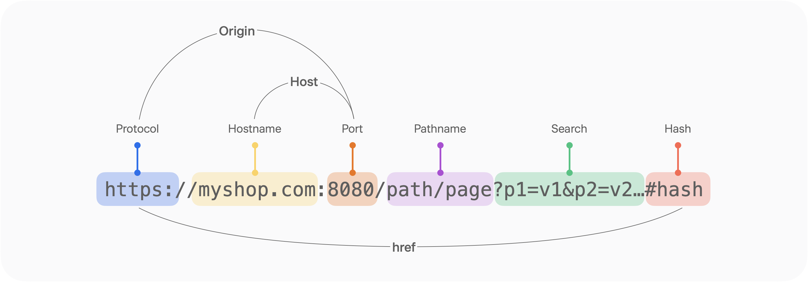

# CORS

## CORS(Cross-Origin Resource Sharing)란?

CORS(Cross-Origin Resource Sharing, 교차 출처 리소스 공유)를 번역하면 "**교차 출처 리소스 공유**"입니다.

이 용어를 이해하기 위해 먼저 출처(Origin)의 개념부터 살펴보겠습니다.

<br/>

### 출처(Origin)**의 구성 요소**

<p align="center">
    
</p>

- Protocol(Scheme) : http, https
- Host : 사이트 도메인
- Port : 포트 번호
- Path : 사이트 내부 경로
- Query string : 요청의 key와 value값
- Fragment : 해시 태그

출처는 단순히 도메인만을 의미하지 않고, 프로토콜(Protocol), 호스트(Host), 포트(Port)를 모두 포함하는 개념입니다.

이 세 가지가 모두 같을 때에만 동일 출처(Same Origin)이며, 그렇지 않은 경우 교차 출처(Cross Origin)로 분류됩니다.

<br/>

### **동일 출처 정책 (SOP, Same-Origin Policy)**

CORS를 이해하기 위해서는 먼저 동일 출처 정책의 개념을 알아야 합니다.

SOP는 “동일한 출처에서 받은 리소스만 자유롭게 접근할 수 있다”는 원칙을 의미합니다.

즉, 동일한 출처의 서버에 있는 리소스는 자유롭게 사용할 수 있지만, 다른 출처의 서버에 있는 리소스에는 기본적으로 접근이 차단됩니다.

예를 들어, 다음은 SOP 규칙에 따라 접근이 가능한지 여부를 나타낸 예시입니다.

| **URL**                                                                | **접근이 가능한가? (SOP를 준수했는가?)** |
| ---------------------------------------------------------------------- | ---------------------------------------- |
| [**https://www.myshop.com/example/**](https://www.myshop.com/example/) | ✅ 프로토콜, 도메인, 포트가 같음         |
| [**https://myshop.com/example2/**](https://myshop.com/example2/)       | ✅ 프로토콜, 도메인, 포트가 같음         |
| [http://myshop.com:3000/example/](http://myshop.com:8080/example/)     | ❌ 프로토콜과 포트가 다름                |
| [**http://en.myshop.com/example/**](http://en.myshop.com/example/)     | ❌ 도메인이 다름                         |
| [**http://www.myshop.com/example/**](http://www.myshop.com/example/)   | ❌ 프로토콜이 다름                       |
| [http://myshop.com:3000/example/](http://myshop.com:8080/example/)     | ❌ 포트가 다름                           |

<br/>

### **동일 출처 정책의 필요성**

출처가 다른 두 애플리케이션이 자유롭게 통신할 수 있다면 매우 위험한 환경이 될 수 있습니다.

예를 들어, 해커가 CSRF(Cross-Site Request Forgery)나 XSS(Cross-Site Scripting) 같은 공격을 통해 악성 코드를 실행시켜 사용자의 민감한 정보를 탈취할 수 있습니다.

이러한 보안 위협을 방지하기 위해 브라우저는 동일 출처 정책을 적용하여 다른 출처의 스크립트 실행을 제한합니다.

<br/>

## 교차 출처 리소스 공유 (Cross-Origin Resource Sharing)

하지만 현대적인 웹 애플리케이션의 구조상, 클라이언트와 API가 서로 다른 도메인에 위치하는 경우가 많습니다.

이때, 모든 교차 출처 요청을 막을 수는 없기 때문에 **일정한 조건을 만족할 경우 예외적으로 허용하는 정책이 바로 CORS**입니다.

<br/>

### 브라우저의 CORS 기본 동작

CORS는 브라우저가 자동으로 추가하고 확인하는 **HTTP 헤더 교환을 통해** 이루어집니다.

1. **클라이언트 요청 시 Origin 헤더 포함**

   브라우저는 서버에 요청을 보낼 때 자동으로 Origin 헤더에 출처 정보를 담습니다.

2. **서버 응답 시 Access-Control-Allow-Origin 헤더 전달**

   서버는 응답 시 Access-Control-Allow-Origin 헤더를 포함하여 허용할 출처를 지정합니다.

3. **브라우저에서 두 값을 비교**

   브라우저는 요청의 Origin 값과 서버가 반환한 Access-Control-Allow-Origin 값을 비교해, 일치하면 응답을 허용하고 불일치할 경우 CORS 오류로 차단합니다.

이 과정을 통해 서버가 허용하지 않은 출처의 요청은 브라우저 수준에서 자동으로 차단됩니다.

<br/>

### 사전 요청 (Preflight Request)

브라우저는 보안 강화를 위해 실제 요청을 보내기 전에 사전 요청(Preflight)을 보냅니다.

이 사전 요청은 HTTP의 **OPTIONS 메소드**를 사용하며, 서버가 해당 요청을 허용하는지 확인한 후 본 요청을 전송합니다.

사전 요청에는 다음 정보가 포함됩니다.

- `Origin`: 요청의 출처
- `Access-Control-Request-Method`: 사용할 실제 HTTP 메소드
- `Access-Control-Request-Headers`: 사용할 커스텀 헤더 목록

서버는 이에 대한 응답으로 아래와 같은 정보를 반환합니다.

- `Access-Control-Allow-Origin`: 허용할 출처
- `Access-Control-Allow-Methods`: 허용할 메소드
- `Access-Control-Allow-Headers`: 허용할 헤더
- `Access-Control-Max-Age`: 사전 요청 결과를 캐시할 시간(초 단위)

이후 브라우저는 브라우저 캐시에 저장된 정책을 참고하여 일정 시간 동안 동일한 요청에 대해 사전 요청을 생략할 수 있습니다.

이렇게 하면 불필요한 `OPTIONS` 요청을 줄여 성능을 향상시킬 수 있습니다.

<br/>

### 단순 요청 (Simple Request)

단순 요청은 사전 요청을 생략하고 바로 본 요청을 서버로 전송하는 방식입니다.

브라우저는 응답으로 반환된 `Access-Control-Allow-Origin` 헤더를 검증하여 접근 가능 여부를 판단합니다.

다만, 다음 세 가지 조건을 모두 만족해야 단순 요청으로 처리됩니다.

1. 요청 메소드는 `GET`, `HEAD`, `POST` 중 하나여야 합니다.
2. 요청 헤더는 `Accept`, `Accept-Language`, `Content-Language`, `DPR`, `Downlink`, `Save-Data`, `Viewport-Width`, `Width` 중 하나여야 합니다.
3. Content-Type은 `application/x-www-form-urlencoded`, `multipart/form-data`, ㄷ 중 하나여야 합니다.

실제 API 요청은 대부분 JSON(application/json)을 사용하기 때문에 대부분의 경우 사전 요청이 발생합니다.

### **인증된 요청 (Credentialed Request)**

인증된 요청은 서버로 자격 인증 정보(Credential)를 함께 전송하는 요청입니다.

여기서 자격 인증 정보란 세션 ID를 저장한 쿠키나 `Authorization` 헤더의 토큰을 의미합니다.

**클라이언트 설정**

기본적으로 브라우저는 보안을 위해 쿠키나 인증 정보를 자동으로 포함하지 않습니다.

이를 전송하기 위해서는 요청 시 **credentials 옵션**을 설정해야 합니다.

| **옵션 값**          | **설명**                                      |
| -------------------- | --------------------------------------------- |
| same-origin (기본값) | 동일 출처 간 요청에만 인증 정보를 포함합니다. |
| include              | 모든 출처 간 요청에 인증 정보를 포함합니다.   |
| omit                 | 인증 정보를 포함하지 않습니다.                |

```jsx
// fetch 예시
fetch("https://example.com:1234/users/login", {
  method: "POST",
  credentials: "include",
  body: JSON.stringify({ userId: 1 }),
});
```

```jsx
// axios 예시
axios.post(
  "https://example.com:1234/users/login",
  {
    profile: { username, password },
  },
  {
    withCredentials: true,
  }
);
```

```jsx
// jQuery 예시
$.ajax({
  url: "https://example.com:1234/users/login",
  type: "POST",
  contentType: "application/json; charset=utf-8",
  dataType: "json",
  xhrFields: { withCredentials: true },
  success: function (res) {
    console.log(JSON.stringify(res));
  },
});
```

**서버 설정**

서버 역시 인증 요청을 허용하도록 적절히 설정해야 합니다.

다음 조건을 만족해야 브라우저의 검증을 통과할 수 있습니다.

- Access-Control-Allow-Credentials: true
- Access-Control-Allow-Origin은 반드시 특정 Origin으로 지정해야 하며, "\*"은 사용할 수 없습니다.
- Access-Control-Allow-Methods 및 Access-Control-Allow-Headers에서도 "\*"을 사용할 수 없습니다.

인증 정보는 민감한 데이터이므로, 반드시 신뢰할 수 있는 출처만 명시해야 합니다.

설정이 올바르지 않으면 다음과 같은 CORS 오류를 보게 됩니다.

- Access-Control-Allow-Credentials가 누락된 경우
- Access-Control-Allow-Origin이 "\*"로 설정된 경우

이러한 과정을 통해 브라우저는 보안을 유지하면서도 서로 다른 출처 간의 안전한 리소스 교환이 가능하도록 합니다.

<br/>
<br/>

> 참고
>
> - https://aws.amazon.com/ko/what-is/cross-origin-resource-sharing/
> - https://docs.tosspayments.com/resources/glossary/cors
> - https://inpa.tistory.com/entry/WEB-%F0%9F%93%9A-CORS-%F0%9F%92%AF-%EC%A0%95%EB%A6%AC-%ED%95%B4%EA%B2%B0-%EB%B0%A9%EB%B2%95-%F0%9F%91%8F
