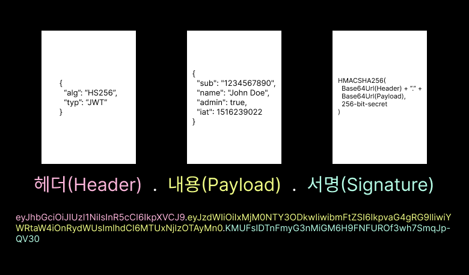

# JWT(JSON Web Token)

## HTTP의 무상태성(Stateless)

웹의 기반이 되는 HTTP프로토콜은 기본적으로 무상태성(Stateless)이라는 특징을 가집니다.

이는 서버가 클라이언트의 이전 요청 기록이나 상태 정보를 기억하지 못한다는 의미입니다.

즉, 각 요청은 서로 독립적으로 처리되며, 서버는 매 요청이 처음 온 것처럼 대응합니다.

이런 구조는 서버의 확장성과 관리가 용이한 장점이 있지만, 클라이언트별 맞춤 서비스나 로그인 상태 유지에 한계를 지닙니다.

 

### 쿠키 (Cookie)

HTTP의 무상태성을 보완하기 위해 등장한 것이 쿠키입니다.

서버는 클라이언트(주로 브라우저)에 데이터(쿠키)를 저장하며, 클라이언트는 다음 요청 시 쿠키를 자동으로 서버에 함께 전송합니다.

서버는 쿠키를 통해 어떤 클라이언트가 요청했는지 식별할 수 있습니다.

하지만 쿠키는 클라이언트 측에 저장되므로 사용자가 내용을 수정하거나 XSS 등 공격을 통해 탈취될 위험이 존재합니다.

 

### 세션 (Session)

세션은 쿠키와 달리 데이터를 서버 측에 저장하고, 클라이언트에는 해당 데이터에 접근할 수 있는 열쇠(Session ID)만 전송합니다.

Session ID는 보통 쿠키에 저장되며, 단순히 의미 없는 문자열을 포함하기 때문에 탈취되어도 직접적인 정보 노출 위험이 적습니다.

그러나 세션 방식은 분산 서버 환경에서는 세션 정보 공유 문제가 발생할 수 있고, 이를 해결하려면 추가적인 시스템 설계가 필요합니다.

 

### 토큰 (Token)

토큰 기반 인증은 세션 기반과 다르게, 서버가 사용자의 상태를 직접 저장하지 않는 **무상태(Stateless)** 방식입니다.

사용자가 인증에 성공하면 서버는 암호화된 토큰을 발급하고, 클라이언트는 이 토큰을 저장했다가 이후 요청마다 HTTP 헤더 등에 실어 서버에 제출합니다.

서버는 토큰만으로 사용자를 인증하고 권한을 검사하기 때문에 개별 서버에 상태를 저장하지 않습니다.

**토큰 방식의 주요 장점**

- 서버가 사용자 상태를 직접 관리하지 않아도 되어, 수평 확장과 분산 환경에서 더욱 유연하게 동작합니다.
- 토큰에 필요한 인증 및 권한 정보를 담을 수 있어, API 기반 서비스와 모바일/웹 등 다양한 환경에서 쉽게 적용할 수 있습니다.
- 토큰의 만료 및 갱신 정책, 데이터 구조를 자유롭게 설계할 수 있고, 인증 로직을 외부 시스템(예: OAuth 서버)과 연계하는 것도 용이합니다.

 

## JWT란?

**JWT**는 "자가 포함 토큰(self-contained token)"이며, 클레임으로 필요한 인증 정보를 토큰 내부에 JSON 형태로 직접 정의합니다.

JWT는 서버에서 별도로 정보를 조회할 필요 없이, 토큰 자체를 해독해 인증 및 권한을 판단할 수 있습니다.

또한, 내부 데이터가 변조되지 않았음을 서명(Signature)으로 검증할 수 있습니다.

일반 토큰은 단순한 식별자 역할을 하고, 모든 정보와 검증이 서버 쪽에서 이루어지는 것과 달리 JWT는 토큰 자체에 인증 정보를 담아, 서버 부하와 구조를 간소화할 수 있고, 무결성 보장과 확장성에 강점을 가집니다.

 

## JWT 구조

    

JWT는 세 파트로 나누어지며, 각 파트는 점으로 구분됩니다.

 

### 헤더 (Header)

> 서명 생성을 위해 사용할 해시 암호화 알고리즘과 토큰의 타입으로 구성

- alg : 서명 암호화 알고리즘(ex: HMAC SHA256, RSA)
- typ : 토큰 유형

 

### 내용 (Payload)

> 내용, 즉 토큰에 담을 클레임(claim) 정보를 포함

- Payload에 담는 정보의 한 ‘조각’을 클레임이라고 부르며, name / value의 한 쌍으로 이뤄짐
- 토큰에는 여러 개의 클레임을 넣을 수 있음
- 클레임의 정보는 등록된(registered) 클레임, 공개(public) 클레임, 비공개(private) 클레임 세 종류
  - 등록된 클레임
    토큰 정보를 표현하기 위해 이미 정해진 종류의 데이터들로, 모두 선택적으로 작성이 가능하며 사용할 것을 권장
    - iss: 토큰 발급자(issuer)
    - sub: 토큰 제목(subject)
    - aud: 토큰 대상자(audience)
    - exp: 토큰 만료 시간(expiration)
    - nbf: 토큰 활성 날짜(not before)
    - iat: 토큰 발급 시간(issued at)
    - jti: JWT 토큰 식별자(JWT ID)
  - 공개 클레임
    사용자 정의 클레임으로, 공개용 정보를 위해 사용된다. 충돌 방지를 위해 URI 포맷을 이용
  - 비공개 클레임
    사용자 정의 클레임으로, 서버와 클라이언트 사이에 임의로 지정한 정보를 저장.
    외부에 공개돼도 상관없지만 해당 유저를 특정할 수 있는 정보들을 담는다.

 

### 서명 (Signature)

> Header, Payload, Secret Key를 합쳐 암호화한 결과값

- Signature
  = HS256(base64UrlEncoding(Header) + . + base64UrlEncoding(Payload), Secret Key)

 

## JWT를 이용한 인증 과정

1. **사용자 로그인 요청**
   - 사용자가 ID와 비밀번호를 입력하여 서버에 로그인 인증을 요청합니다.
2. **서버에서 인증 및 JWT 생성**
   - 서버는 전달받은 인증 정보를 검증한 뒤, 사용자가 정상적으로 인증되면 JWT를 생성합니다.
   - JWT는 **Header, Payload, Signature** 세 부분으로 구성됩니다.
   - Payload에는 사용자 정보(예: 사용자 ID, 권한, 유효기간 등)와 함께 필요한 클레임을 포함시킵니다.
   - Header와 Payload는 각각 Base64로 인코딩되며, 비밀키로 서명(Signature)을 생성해 세 부분을 결합합니다.
   - 생성된 JWT 토큰은 일반적으로 서버 응답의 쿠키나 응답 본문으로 클라이언트에 전달됩니다.
3. **JWT 저장 및 API 요청**
   - 클라이언트는 서버로부터 받은 JWT를 **로컬 스토리지**나 또는 쿠키(또는 세션 스토리지 등)에 저장합니다.
   - 이후 API 요청이 필요할 때마다 HTTP Authorization 헤더에 해당 토큰을 'Bearer {토큰}' 형식으로 담아 서버에게 요청을 보냅니다.
4. **서버의 토큰 검증**
   - 서버는 클라이언트가 보낸 JWT의 서명을 검증하여, 실제로 본인이 발급한 토큰이 맞는지, 토큰이 만료되지 않았는지 확인합니다.
   - 유효한 토큰이면 Payload에 담긴 사용자 정보를 이용해 해당 요청을 처리해줍니다.
5. **Access Token 만료와 Refresh Token**
   - Access Token의 유효기간이 끝나면, 클라이언트는 Refresh Token(일반적으로 별도 보관, DB 연동)으로 서버에 새로운 액세스 토큰을 요청할 수 있습니다.
   - 서버는 Refresh Token 검증 후 새로운 Access Token을 발급해 클라이언트에 전달합니다.

 

### **Access Token과 Refresh Token**

- **Access Token**
  사용자 인증 정보와 권한을 담고 있는 실제 사용 토큰으로, 모든 API 요청에 담아 서버에서 인증 처리를 진행합니다.
  수명이 짧게 설계되어 보안성이 높습니다.
- **Refresh Token**
  Access Token이 만료됐을 때, 새로운 Access Token을 재발급받기 위한 토큰입니다.
  보통 이 토큰은 별도의 안전한 저장소(주로 DB)에 관리되며, 노출 시 추가 인증 절차가 필요합니다.

 

## JWT의 장단점

**장점**

- 서명을 통해 데이터 위변조를 방지할 수 있습니다.
- 토큰이 self-contained(자가 포함) 형태로, 인증에 필요한 정보를 토큰에 직접 담을 수 있습니다.
- 인증 정보를 서버에 별도로 저장할 필요가 없어, 분산 서버 환경과 서버 확장(Stateless 구조)에 매우 유리합니다.
- 다양한 플랫폼(웹, 모바일 등)과 연동이 쉬우며, 다른 서비스나 OAuth와 같은 외부 로그인 시스템과의 연계도 효과적으로 지원합니다.
- 서버에서는 토큰만 검증하면 되므로, 별도의 세션 관리 시스템이 불필요합니다.

**단점 및 주의사항**

- Payload는 암호화된 것이 아니라 단순히 Base64로 인코딩되어 있기 때문에, 중간에서 탈취 시 누구나 토큰의 정보를 쉽게 확인할 수 있습니다.
  따라서 민감한 정보는 Payload에 담지 않아야 합니다.
- 토큰 자체가 탈취되면 바로 악용될 수 있으므로, 클라이언트 측 저장 및 관리(특히 XSS 공격 대비)에 주의해야 합니다.
- 토큰이 self-contained된 구조이기 때문에, 토큰의 길이가 길어질 수 있으며 네트워크 부담이 일부 증가할 수 있습니다.

 
 

> 참고
>
> - https://inpa.tistory.com/entry/WEB-%F0%9F%93%9A-JWTjson-web-token-%EB%9E%80-%F0%9F%92%AF-%EC%A0%95%EB%A6%AC
> - https://ko.wikipedia.org/wiki/JSON_%EC%9B%B9_%ED%86%A0%ED%81%B0
> - https://ivory-room.tistory.com/88
> - https://ego2-1.tistory.com/40
