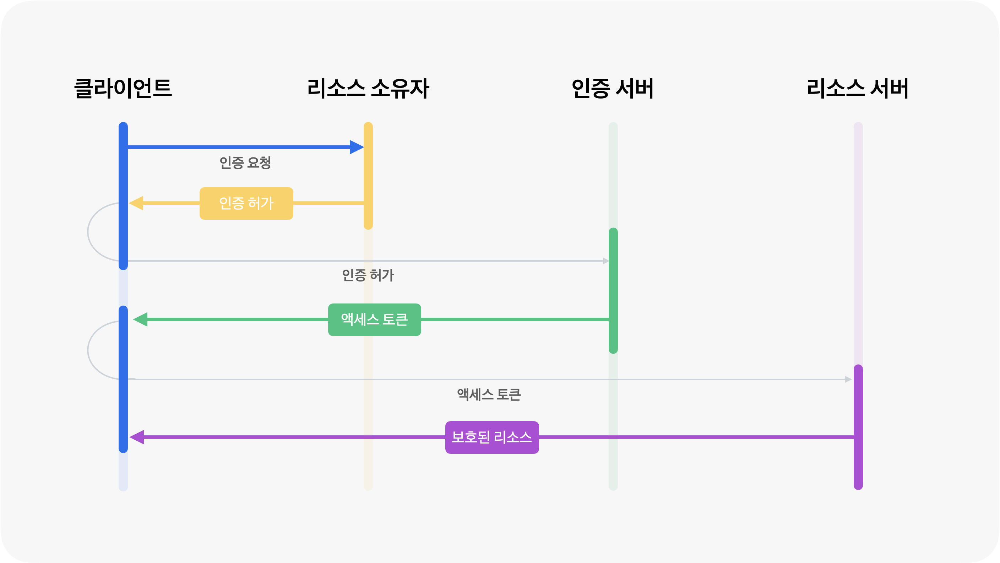

# OAuth

## OAuth란?

OAuth는 제3자의 클라이언트에게 보호된 리소스를 제한적으로 접근하게 해주는 기술 표준입니다.

새로운 웹사이트 사용 시 구글, 네이버와 같은 소셜 계정으로 바로 로그인 및 회원가입을 할 수 있는 기능이 이에 해당됩니다.

OAuth는 사용자 이름, 비밀번호 등의 실제 사용자 자격 증명을 공유하지 않고 한 서비스에서 다른 서비스로 권한 부여를 전달하기 위한 프로토콜입니다.

OAuth를 사용하면 두 애플리케이션이 무엇인지와 관계없이 한 애플리케이션에서 다른 애플리케이션으로 권한 부여를 전달할 수 있습니다.

 

### OAuth 2.0이란?

OAuth 2.0은 OAuth 1.0에 비해 구조, 사용성, 보안 등 다양한 측면에서 여러 개선점을 도입한 개정 버전입니다.

OAuth 2.0은 서명 대신 보안 토큰 방식을 도입해 인증 구조를 단순화하고 HTTPS 기반의 보안, 다양한 플랫폼 지원, 토큰 유효기간 및 재발급, 서버 구조 분리 등 실질적인 사용성과 대규모 확장성을 크게 높였습니다.

OAuth 1.0은 더 엄격한 서명 기반 보안 구조였지만, 사용성과 확장성, 관리 측면에서는 OAuth 2.0이 명확한 우위를 갖게 되었습니다.

 

### OAuth는 무엇에 사용될까

OAuth는 사용자에게 권한을 부여하고 한 애플리케이션이 다른 애플리케이션에 대한 부분 액세스를 허용하는 데 모두 사용할 수 있습니다.

사용자가 자주 접하는 사용 사례 중 하나는 앱이 소셜 미디어 플랫폼이나 다른 온라인 계정에 액세스하도록 허용하는 것입니다.

기업의 경우 OAuth의 보다 일반적인 사용 사례는 ID 및 액세스 관리(IAM) 시스템과 관련됩니다.

예를 들어 직원은 사용자 이름과 비밀번호를 사용하여 회사의 SSO 시스템에 로그인할 수 있습니다.

이 SSO 시스템을 통해 작업을 수행하는 데 필요한 모든 애플리케이션에 대한 액세스 권한이 부여되고, SSO 시스템은 이러한 앱에 OAuth 인증 토큰을 전달하여 이를 수행합니다.

 

## OAuth 구성 요소

    

- **리소스 소유자**: 리소스(개인정보)를 소유하는 자, 사용자
- **클라이언트**: 사용자의 정보를 접근하는 제3자의 서비스
- **인증 서버**: 클라이언트의 접근을 관리하는 서버
- **리소스 서버**: 리소스 소유자의 데이터를 관리하는 서버 (구글, 네이버 등)

먼저, **리소스 소유자가** 구글과 같은 소셜 계정에 로그인하는 과정을 통해 **클라이언트에게 인증을 허가합니다**.

이때 리소스 소유자는 클라이언트와 어떤 정보를 공유할지 선택할 수 있습니다.

리소스 소유자의 동의가 확인되면 **인증 서버는 클라이언트에게 액세스 토큰(Access Token)과 리프레시 토큰(Refresh Token)을 발급합니다.**

클라이언트는 액세스 토큰을 사용해서 리소스 서버에 보호된 데이터를 불러올 수 있습니다.

하지만 보안 문제로 액세스 토큰은 만료 기간이 있고, 리소스 소유자가 다시 로그인해야 하는 번거로움이 있는데요.

액세스 토큰이 만료되기 전에 리프레시 토큰으로 액세스 토큰을 재발급 받을 수 있습니다.

 

## SAML과 OAuth의 비교

### SSO (Single Sign-On)

SSO(Single Sign-On, 단일 로그인)는 사용자가 한 번의 인증으로 여러 애플리케이션이나 시스템에 반복 로그인 없이 접근할 수 있게 해 주는 인증 방식입니다.

예를 들어 회사 이메일, 캘린더, 내부 ERP 시스템에 각각 로그인하지 않고 한 번만 로그인하여 해당 자원을 모두 사용할 수 있습니다.

**SSO는 하나의 접근 방식**이며, 인증이나 권한 부여 기능이 있는 표준 프로토콜을 실제 구현 방식으로 선택해야 합니다.

**SAML과 OAuth는 SSO를 지원하는 대표적인 프로토콜**로 사용됩니다.

하지만 두 프로토콜은 목적과 기능이 다릅니다.

 

### SAML vs OAuth

권한 부여와 인증은 비슷하게 들리지만, 액세스 관리 내에서는 완전히 동일하지는 않으며 액세스 관리 기술(OAuth 포함)이 작동하는 방식을 이해하려면 둘의 차이를 아는 것이 아주 중요합니다.

인증은 "내가 누구인가요?"에 대한 질문이고, 권한 부여는 "나는 무엇을 할 수 있나요?"에 대한 질문입니다.

Bob이 경비실이 있는 안전한 시설에서 근무한다고 상상해 봅시다.

시설에 들어오는 모든 차량은 경비실 앞에서 정차하며 혀용된 직원만 출입할 수 있습니다.

경비실은 사용자 인증이 이루어지는 곳입니다.

경비원은 직원 목록을 대조해서 Bob의 신분증을 확인하고 허용된 차량 목록에서 차량 번호판을 확인합니다.

경비실에서 Bob의 신원과 차량을 인증할 수 있으면, Bob은 시설의 주차장에 차를 몰고 가서 주차할 수 있습니다.

그러나 Bob이 시설에 운전해서 들어갈 수 있다고 해서 원하는 곳에 주차할 수 있다는 의미는 아닙니다.

직원 유형별로 지정된 주차장이 있고, Bob은 지정된 주차장에만 주차할 수 있습니다.

그는 CEO의 주차 공간에는 주차할 수 없습니다.

- **인증(Authentication)**

  인증은 사용자의 신원을 확인하는 과정입니다.
  경비실에서 Bob의 신분증과 차량 번호판을 확인해 "Bob이 누구인지" 식별하고, 그가 시설에 들어갈 자격이 있는지 판단하는 단계와 같습니다.
  이 단계에서 사용자의 아이디와 비밀번호 등의 자격 증명이 검증되며, 시스템은 사용자가 등록된 합법적인 사용자임을 보증합니다.
  SAML 프로토콜은 이 인증 과정을 지원하며, 사용자가 누구인지를 확인하여 단일 로그인(SSO)을 가능하게 합니다.

- **권한 부여(Authorization)**

  권한 부여는 인증된 사용자가 시스템 내에서 무엇을 할 수 있는지 결정하는 과정입니다.
  경비실을 통과한 Bob이 '어디에 주차할 수 있는지' 결정하는 것이 이에 해당합니다.
  Bob이 CEO 전용 주차 공간에 주차할 권한이 없듯, 권한 부여는 사용자가 특정 리소스나 작업에 접근할 수 있는 권한을 제어합니다.
  OAuth 프로토콜은 이러한 권한 부여를 담당하여, 예를 들어 제3자 앱이 사용자의 데이터 일부에만 접근할 수 있도록 제한하는 기능을 수행합니다.

즉, **SAML = 인증 프로토콜**로 사용자의 신원을 확인해 시스템 접근을 허용하는 역할이며

**OAuth = 권한 부여 프로토콜**로 인증된 사용자가 어떤 리소스에 접근할 수 있는지 권한을 부여하는 역할입니다.

 
 

> 참고
>
> - https://inpa.tistory.com/entry/WEB-%F0%9F%93%9A-OAuth-20-%EA%B0%9C%EB%85%90-%F0%9F%92%AF-%EC%A0%95%EB%A6%AC
> - https://www.cloudflare.com/ko-kr/learning/access-management/what-is-oauth/
> - https://docs.tosspayments.com/resources/glossary/oauth
> - https://somaz.tistory.com/296
